<div align="center">

# 👋 Hi, I'm Vinay Papnoi

### Flutter App Developer • Cross-Platform Mobile Engineer


<p>
  <a href="https://github.com/VinayPapnoi">
    
  </a>
  <a href="https://www.linkedin.com/in/vinay-papnoi-7871991b4/">
    
  </a>
  <a href="https://www.codechef.com/users/vinay_papnoi">
    
  </a>
  <a href="https://codeforces.com/profile/papnoi.vinay">
    
  </a>
  <a href="mailto:papnoi.vinay@gmail.com">
    
  </a>
</p>

</div>

---

## 🚀 About Me

<table>
<tr>
<td width="60%" valign="top">

I'm a **Flutter App Developer** studying Computer Science (AI & ML) in India, focused on building
**production-grade, cross-platform mobile apps** with clean architecture and real-time data.

### What I Do
- 📱 **Mobile Development** — cross-platform Android/iOS apps with Flutter & Dart
- 🔌 **Backend Integration** — Firebase, REST APIs, and real-time data sync
- 🧩 **State Management** — BLoC & Riverpod for scalable, maintainable apps
- 📡 **Offline-First Engineering** — apps designed to work on poor or intermittent networks

> *"The best app is the one that still works when the network doesn't."*

</td>
<td width="40%" valign="top">

### 📈 Quick Stats

```text
🎯 Focus Areas
├─ Mobile:  Flutter & Dart
├─ State:   BLoC, Riverpod
├─ Backend: Firebase
└─ Data:    REST APIs, SQLite

🌱 Currently
├─ Learning system design
├─ Exploring native modules
└─ Building AyuSync (SIH 2026)
```

</td>
</tr>
</table>

---

## 💻 Tech Stack

<table>
<tr>
<td valign="top" width="50%">

### Mobile & Frontend


</td>
<td valign="top" width="50%">

### Backend & Data


</td>
</tr>
<tr>
<td valign="top" width="50%">

### State Management & Architecture


</td>
<td valign="top" width="50%">

### Languages & Tools


</td>
</tr>
</table>

---

## 🎯 Featured Projects

<table>
<tr>
<td width="50%" valign="top">

### 🏥 AyuSync
<sub><b>Offline-First Rural Healthcare Platform</b></sub>

Built for Smart India Hackathon 2026 — an offline-first Flutter client for frontline ASHA workers, with a persistent mutation queue, live network-quality probing, and an explainable-AI triage workflow.

**Tech:** `Flutter` `Dart` `SQLite` `REST APIs`

🔗 **Repo:** [github.com/VinayPapnoi/AyuSync](https://github.com/VinayPapnoi/AyuSync)

</td>
<td width="50%" valign="top">

### 🍽️ OrderUp
<sub><b>Smart Canteen Management System</b></sub>

A full canteen ordering platform with real-time order tracking, role-based user/admin dashboards, and a clean, responsive UI built across 5+ reusable Flutter screens.

**Tech:** `Flutter` `Dart` `Firebase` `Riverpod`

🔗 **Repo:** [github.com/VinayPapnoi/OrderUp](https://github.com/VinayPapnoi/OrderUp)

</td>
</tr>

<tr>
<td width="50%" valign="top">

### 🗺️ District App Clone
<sub><b>Content Discovery App</b></sub>

A fully functional clone mirroring a district-based content app, with modular UI screens and real-time Firestore sync — optimized to cut initial load times by 40%.

**Tech:** `Flutter` `Dart` `Firebase` `Cloud Firestore`

🔗 **Repo:** [github.com/VinayPapnoi/District-App](https://github.com/VinayPapnoi/District-App)

</td>
<td width="50%" valign="top">

### 🔗 More on GitHub

Every project above started from a real constraint — spotty rural networks, real canteen queues, or a content app worth rebuilding faster. More experiments and in-progress work live on my profile.

🔗 **Explore:** [github.com/VinayPapnoi?tab=repositories](https://github.com/VinayPapnoi?tab=repositories)

</td>
</tr>
</table>

---

## 📊 GitHub Analytics

<div align="center">

### 📈 Stats Overview



</div>

<table>
<tr>
<td width="50%" valign="top">

### 🧬 Top Languages



</td>
<td width="50%" valign="top">

### 🔥 Streak Stats


</td>
</tr>
</table>

### 📅 Activity Graph


---

## 📫 Let's Connect

<div align="center">

I'm always open to conversations about Flutter, offline-first architecture, or Smart India Hackathon builds. Reach out on [LinkedIn](https://www.linkedin.com/in/vinay-papnoi-7871991b4/) or drop a line at [papnoi.vinay@gmail.com](mailto:papnoi.vinay@gmail.com).

*"Hot reload fixed it, I have no idea why, and I've made peace with that."*


</div>

